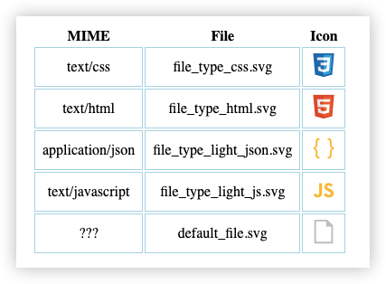

# MIME icons

Give an icon to a web resource file by `Content-Type` or `url` subfix.

### Usage

```sh
npm install mime-icons
```

First, **MUST** copy `icons` folder to your project's public files path.

Now, import module, with `getIconName` function, you will get the target icon name. The function get 2 optional parameters:

| parameter   | from                                  |
| ----------- | ------------------------------------- |
| contentType | HTTP response header's `Content-Type` |
| url         | resource url                          |

**example**:

```js
import mime from "mime-icons";

const icon = mime.getIconName({
  contentType: "text/html",
  url: "http://xxx.com/index.html",
});

const imagePath = env.PUBLIC_PATH + "/icons/" + icon;
```

### Example

```sh
git clone https://github.com/DeronW/mime-icons
cd mime-icons/demo
npm i
npm run dev
```

then, open http://localhost:5173 in browser, and see



### Resources

Thanks to [apache](http://svn.apache.org/repos/asf/httpd/httpd/trunk/docs/conf/mime.types) for content-type and file extensions mapping, and [vscode-icons](https://github.com/vscode-icons/vscode-icons) for extensions icons.

**override**

Some files has common extension, use common use case overwrite it, such as `js`, `css`, `html` and soon, see belog:

```js
appendExtension("html", "html", false);
appendExtension("css", "css", false);
appendExtension("json", "json", true);
appendExtension("js", "js", true);
```
